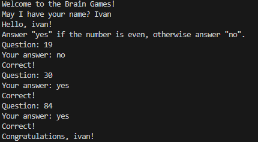
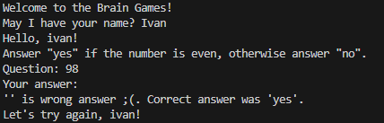
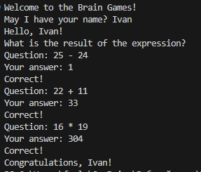
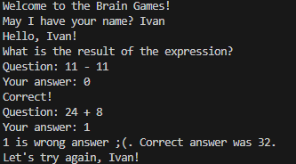
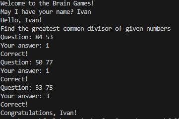
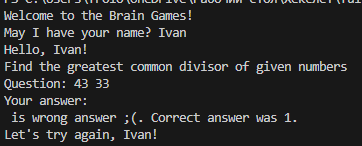

# Brain Games

"Mind Games" is a set of five console games based on popular mobile apps for pumping up the brain. Each game asks questions that need to be answered correctly. After three correct answers, the game is considered completed. Incorrect answers end the game and offer to play it again. Each game is described and demonstrated below.

## Games

1. **Determining an even number.**
2. **Determining a prime number.**
3. **Calculator. Arithmetic expressions that need to be calculated.**
4. **Progression. Finding missing numbers in a sequence of numbers.**
5. **Determining the greatest common divisor.**

## System Requirements

To run the "Mind Games" project, you need to have Node.js installed on your system.

### Installing Node.js

1. **Download the latest version of Node.js:**

   - Visit the official [Node.js website](https://nodejs.org/).
   - Download the latest stable version for your operating system (Windows, macOS, or Linux).

2. **Install Node.js:**

   - Run the downloaded installer and follow the installation instructions.
   - Ensure that the installation includes npm (Node Package Manager), which is usually included by default.

3. **Verify the installation:**
   - Open a terminal or command prompt.
   - Run the following commands to verify that Node.js and npm are installed correctly:
     ```bash
     node -v
     npm -v
     ```
   - You should see the version numbers of Node.js and npm printed in the terminal.

## Hexlet Tests and Linter Status

[](https://github.com/IVANFROL/fullstack-javascript-project-44/actions)

## Installation

### Cloning the Repository

1. Clone the repository to your local machine:

   ```bash
   Clone the repository:
   git clone https://github.com/IVANFROL/fullstack-javascript-project-44.git

   Go to the catalog:
   cd fullstack-javascript-project-44

   Installing games:
   npm link/make install link
   ```

To install the game, run the following command:

```bash
npm install -g
```

## Running the Game

To start the game, use the following command:

```bash
brain-even
```




```bash
brain-calc
```




```bash
brain-gcd
```



